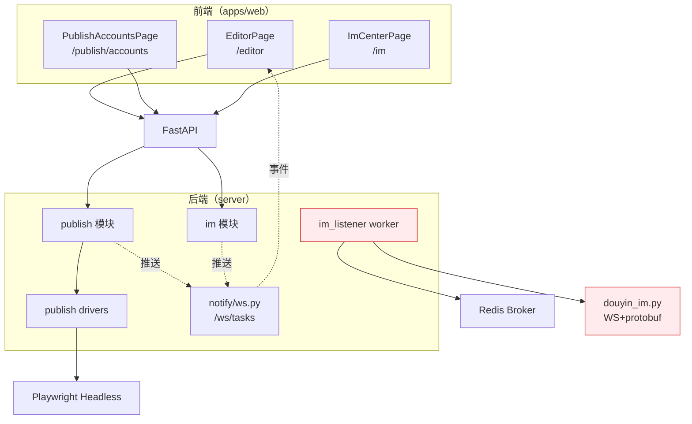

# 口播 IP 智能体核心模块分析报告

**版本**: v1.1（经全量代码核查修订）
**日期**: 2026-07-30
**范围**: 视频剪辑 / 发布管理 / 私信中心三大模块
**结论**: 业务完整性良好。私信模块采用**收发分离架构**：监听聚合（已实现，基于 DouYin_Spider 接收链路）保留；发送侧改用**嵌入抖音官方网页**方案（方案 E，Tauri WebView），已否决 DouYin_Spider 逆向代发（方案 D，合规与封号风险过高）。生产 No-Go（`config.py`）待"只读监听模式"放开。其余两模块存在技术债但无阻塞性缺陷。

---

## 修订说明（v1.0 → v1.2）

v1.0 报告基于较早代码快照撰写，未同步近期 commit。本次逐项对照 `server/` 与 `apps/web/` 源码核查，修正如下：

| 类别 | 数量 | 处理 |
|------|------|------|
| 与代码现状直接矛盾（已实现被当成待修复） | 6 项 | 改标"已实现/不成立"，附证据 |
| 描述或技术建议有误 | 5 项 | 修正结论与建议方向 |
| 配置项/数字错误 | 3 处 | 更正 |
| 遗漏的真实问题 | 5 项 | 新增第六章 |
| 私信生产化方案缺失 | 1 项 | 新增第七章 |

> **v1.2 增量**：发送方案最终选定为**方案 E（嵌入抖音官方网页，Tauri WebView）**，否决方案 D（DouYin_Spider 逆向代发）。第七章已重写为收发分离架构，最小验证代码已完成（`apps/desktop/src-tauri/src/main.rs` 加 `open_douyin_im` 命令 + `apps/web/src/lib/douyinWebview.ts` 封装 + `ImCenterPage` 入口按钮），Rust 编译通过，待真机验证。

所有结论均附 `文件:行号` 证据，可复核。

---

## 一、整体架构概览



### 关键路径索引

| 模块 | 前端入口 | 后端路由 | Worker/后台任务 |
|------|---------|----------|----------------|
| **视频剪辑** | `apps/web/src/pages/EditorPage.tsx`（1079 行） | `/api/v1/pipeline/*` | FFmpegCompose（容器化合成） |
| **发布管理** | `apps/web/src/pages/PublishAccountsPage.tsx`（690 行） | `/api/v1/publish/*` | `publish.*Driver._do_publish()` + heartbeat_loop |
| **私信中心** | `apps/web/src/pages/ImCenterPage.tsx`（441 行） | `/api/v1/im/*` | `app.workers.im_listener`（独立 supervisor） |

---

## 二、视频剪辑模块深度分析

### 2.1 当前功能实现

**定位**: "F-505 成片定稿台" — 在流水线 `compose` 合成完成后，提供所见即所得的精细化编辑能力，产出发布级内容草案。

**核心能力**（均已实现）:
- 视频预览（原生 `<video>` 标签）
- 字幕实时叠加预览（拖拽定位 + 样式调整）
- AI 辅助标题/标签生成（调用 LLM，带前端清洗）
- 封面候选帧：**通过显式 API** `pipelineApi.coverCandidates(taskId)` 获取（`EditorPage.tsx:159-160`），而非 artifact 键硬编码
- 封面模板渲染（4 种预设）
- 自动保存草稿（防抖 700ms，CAS 幂等校验，`draftRevision` 乐观锁）
- 定额控制前置（hd_export 消耗配额）
- 状态同步（draft/finalized/rendering 三态）

**关键技术点**:
- 双缓冲保存：`saveNow()` 返回 Promise，并发请求串行化，旧响应不覆盖新编辑（已有单测验证）
- 封面预览异步缓存：debounce + 取消旧请求
- 纯客户端字幕合成：直接 DOM overlay，不请求后端重渲染

### 2.2 问题清单（经核查）

#### P0 — 高优先级

| 编号 | 核查结论 | 问题描述与证据 |
|------|---------|---------------|
| **V-01** | **部分成立** | 现有 `EditorPage.test.tsx` 已含 4 个高质量单测（CAS 并发保存、乐观更新不覆盖、AI 填充、合成定稿），非"仅覆盖 Mock"那么薄弱；但缺 Playwright E2E（create→compose→editor→合成）确属合理增量。**注意**：后端已有 `test_publish_full_flow.py`、`test_pipeline_recompose.py` 等集成测试，v1.0 "缺少真实端到端测试"的论调忽略了这些资产 |
| **V-02** | **❌ 不成立（已实现）** | v1.0 称"封面候选帧依赖 artifact 键硬编码，建议改为 cover-candidates 显式接口"——该接口**早已实现**：前端 `EditorPage.tsx:159-160` 调用 `pipelineApi.coverCandidates`，后端 `pipeline/router.py:105` 暴露 `/cover-candidates`。`:127` 处对 `final_video_key` 的判断只是 compose 完成门，非封面数据来源 |
| **V-03** | **可能成立** | 错误提示保留内部术语（如 `HttpError`），缺统一错误码映射表与 i18n。方向合理，v1.0 未给出具体越界案例 |

#### P1 — 中优先级

| 编号 | 核查结论 | 问题描述 |
|------|---------|---------|
| **V-04** | 成立 | 无离线编辑兜底，断网即丢失草稿编辑态 |
| **V-05** | 成立 | 字幕 segment 不支持拆分/合并，仅能改文本 |
| **V-06** | 成立 | AI 建议单组降级逻辑粗糙，后端应统一输出 `{ groups: [] }` |

#### P2 — 低优先级

- **V-07**: 字幕拖动绑在 `window` pointermove，易误触，建议限制在 video container
- **V-08**: 标题/标签无提前字数预警（超限才禁输入）
- **V-09**: 无多用户协作标记，并发编辑可能互相覆盖

### 2.3 业务评估

- **优势**: 所见即所得 + CAS 乐观更新体验流畅；定额前置防超额
- **风险**: 单组件 1079 行偏大；对 compose 产物结构依赖较紧
- **机会**: 接入点击热力图；按历史发布成功率反向推荐配置

---

## 三、发布管理模块深度分析

### 3.1 当前功能实现

**定位**: F-501/F-502 扫码授权 + F-503/F-504 自动化发布，支持抖音/小红书/腾讯视频，驱动抽象 + 浏览器自动化架构。

**核心能力**（均已实现）:
- 扫码登录流程 + 登录态心跳检测（`publish_cookie_heartbeat_min` 可配，默认 30 分钟）
- 发布模式分级（automatic / semi_automatic / export_only / development_mock）
- `PUBLISH_FORCE_REAL` 开关：dev 环境下强制真实驱动而不切 app_env（`config.py:117`、`publish/service.py:107`、`registry.py:63`，commit `627e00d`）
- `publish_verified_platforms` 白名单控制真实发布验收
- 幂等 Job（idempotencyKey）+ 重试（指数退避）
- 跨平台能力发现（capabilities 动态查询，前端已展示 `· 仅导出` 标签，`PublishAccountsPage.tsx:440`）
- Cookie 加密存储（`session_crypto.py`，Fernet 对称加密）

### 3.2 问题清单（经核查）

#### P0 — 高优先级

| 编号 | 核查结论 | 问题描述与证据 |
|------|---------|---------------|
| **P-01** | **❌ 不成立（已实现）** | v1.0 称"未区分生产/开发，建议引入 PUBLISH_FORCE_REAL"——该开关**已完整实现**（commit `627e00d`）。`config.py:117` 注释还说明：仅开此开关不够，还需把平台加入 `publish_verified_platforms`，否则扫码入口返回 409 AUTOMATION_NOT_VERIFIED |
| **P-02** | **部分不成立** | v1.0 称"未认证平台静默降级无引导"——前端 `PublishAccountsPage.tsx:360,440` 已按 `automaticEnabled` 展示 `· 仅导出`。缺的是"申请认证"指引链接与更显眼的灰色标签，属增量优化非空白 |
| **P-03** | **建议有技术错误** | 30 分钟探测频率属实（`heartbeat.py:18`，可配）。但 v1.0 建议"改用 refresh_token grant"**不成立**：抖音此处走浏览器扫码 Cookie（Fernet 加密 session），**不是 OAuth2 token，没有 refresh_token 机制**。正确缓解：降频 + 随机抖动 + 用轻量探针接口 + 失败才升级为重量级校验 |

#### P1 — 中优先级

| 编号 | 核查结论 | 问题描述与证据 |
|------|---------|---------------|
| **P-04** | **❌ 不成立（数字编造）** | v1.0 称"轮询固定 3s"——实际 `PublishAccountsPage.tsx:139` 为 30s、`:501` 为 15s，`PublishJobsPage.tsx:203` 为 10s。**代码中无任何 3s 轮询**。"按状态动态调整间隔"的建议本身合理 |
| **P-05** | **部分成立** | `publish_max_concurrency` 默认 2（`config.py:109`），但是**可配置**（非硬编码），`browser_pool.py:19` 从 settings 读取。"无自适应调度/优先级"部分成立 |
| **P-06** | 可能成立 | 未注册抖音审核结果 webhook，全靠后端轮询。方向合理，取决于抖音开放平台回调可用性 |

#### P2 — 低优先级

- **P-07**: 二维码弹窗无关闭防呆，取消 reauth 可能遗留 orphan ticket
- **P-08**: 发布包下载无分片断点续传，大视频易失败
- **P-09**: 未对发布失败做根因分类（网络/违规/封禁），无法 BI 分析

### 3.3 业务评估

- **优势**: 驱动抽象质量高（`base_driver.py` 362 行，新增平台只需实现 `_do_publish()`）；Redis Lease 防重复执行；幂等性充足
- **风险**: 多数平台仍 `unverified`；浏览器自动化易被风控
- **机会**: 发布健康看板（各平台成功率/耗时）；A/B 测试标题标签

---

## 四、私信中心模块深度分析

### 4.1 当前功能实现与**关键阻塞**

**定位**: F-506 抖音私信监听与自动回复引擎。

**能力现状（必须区分收/发）**:

| 能力 | 状态 | 证据 |
|------|------|------|
| 长连接**监听接收** | ✅ 已实现 | `douyin_im.py` 走 `wss://frontier-im.douyin.com/ws/v2` + protobuf 解析（整合自开源 `DouYin_Spider`） |
| **发送/回复** | ❌ **fail-closed** | `douyin_im.py:261-268` `send_message()`/`create_conversation()` 主动 `raise DouyinIMUnsupportedError("...缺少固定 Request protobuf + 签名测试证据，已按 fail-closed 拒绝")` |
| **生产环境启用** | ❌ **合规阻断** | `config.py:138-139` `im_enabled=True` 且非 dev/test 时 `raise RuntimeError("第三阶段合规结论为 No-Go：生产环境不得启用 IM_ENABLED")` |

> **核心结论**：私信模块当前"能听不能回"，且生产环境被合规硬阻断。`test_im_send_truth.py` 测试的是发送**状态机/重试/人工接管**，而非真实发出——provider 层根本发不出去。这是三大模块中**唯一的生产级阻塞**，详见第七章方案。

其余已实现的能力:
- 会话聚合（按 remote_uid 分组）
- 自动回复规则引擎（trigger_type: keyword/pattern/schedule）——规则可配，但触发后**发不出去**
- 风控限流（`MAX_REPLIES_PER_MINUTE`、每日上限）
- 内容审核（`moderation.py` 敏感词过滤）
- 灰度账号控制（`im_gray_enforced` + `im_gray_max_accounts=20` + DB 表 `im_gray_accounts`）
- Listener State 持久化 + Redis lease
- Supervisor 自愈循环（`reconcile_listeners`，`RECONCILE_INTERVAL=5s`）

### 4.2 问题清单（经核查）

#### P0 — 高优先级

| 编号 | 核查结论 | 问题描述与证据 |
|------|---------|---------------|
| **I-00** | **成立（新增）** | **发送侧方案 E（嵌入官方网页）待落地 + 合规阻断待解除**，见第七章。这是私信模块当前唯一 P0 |
| **I-01** | **❌ 描述不准确** | v1.0 称"IM_ENABLED=false 时无日志"——supervisor 主入口 `im_listener.py:172-173` **已输出** `logger.info("[IMWorker] IM_ENABLED=false; supervisor stopped")`。仅 `reconcile_listeners:132` 辅助函数静默 return。运行时实际有日志 |
| **I-02** | **成立** | 灰度账号前端无提示。`ImCenterPage.tsx` grep 灰度相关完全为空，用户不在灰度名单时无任何引导 |
| **I-03** | **成立，且根因更严重** | `im_listener.py:382-387` 失败 5 次后 `_set_listener_error` 并 return，退避仅 `min(10*n,60)`。**真正根因**：error 状态后 `reconcile_listeners` 只拉 `status=="listening"`（`:144`），**网络恢复也不会自愈**，需人工改状态。v1.0 只看到"5 次退出"表象 |

#### P1 — 中优先级

| 编号 | 核查结论 | 问题描述与证据 |
|------|---------|---------------|
| **I-04** | **❌ 不成立** | v1.0 称"分页无限加载致内存泄漏"——实际 `ImCenterPage.tsx:46-47,293,303` 是**分页翻页**（每页 50、上/下一页按钮），`messages = items.slice().reverse()` 不累加历史页。不存在内存暴涨 |
| **I-05** | **成立** | `reply_template` 纯字符串，无变量占位符（`${nickname}` 等） |
| **I-06** | **成立** | 无消息撤回，`send_status` 未见 revoked 态 |

#### P2 — 低优先级

- **I-07**: 无消息已读回执
- **I-08**: 不支持富文本媒体消息
- **I-09**: 自动回复规则无生效比例统计

> **配置项更正**：v1.0 多处写 `IM_GRAY_ACCOUNT_ALLOWLIST`，代码中**不存在此常量**。实际为 `im_gray_enforced`(bool) + `im_gray_max_accounts`(=20) + DB 表 `im_gray_accounts`（`models.py:148`）。

### 4.3 业务评估

- **优势**: 监听链路完整；supervisor + lease 自愈；限流防 spam；灰度可审计（commit `a677ea9`、`bc415ea`）
- **风险**: 发送协议依赖逆向，抖音协议升级即断裂；单进程长连接 FD 占用；自动回复规则简单
- **机会**: LLM 个性化回复；私信转化漏斗指标

---

## 五、共性问题与系统性风险（经核查）

### 5.1 跨源媒体路径陷阱

**问题成立，但 v1.0 修复建议方向有误。**

- `storage.py:219` `signed_media_path()` 返回的是**相对路径** `/media/{key}?exp=&sig=`——**这正是跨源问题的根源**，而非解药。
- 真正返回绝对 URL 的是 `get_accessible_url()`（`storage.py:247`，拼 `media_public_base_url`）。
- v1.0 建议"所有 `/media` 必须通过 `signed_media_path()` 重写"等于没解决问题。

**正确修复**: 前端应拿到绝对 URL（后端统一用 `get_accessible_url` 输出），或前端按运行环境（Tauri 5173 vs Web 8000）拼接正确 origin；并加 `Cross-Origin-Resource-Policy` 头。

### 5.2 登录态持久化缺陷

方向合理（未深验 Tauri 激活机制）。JWT in localStorage，桌面端重装即失效，缺设备绑定 + 机器指纹 + 云端 refresh。

### 5.3 Tauri macOS 麦克风权限

**❌ 不成立（已实现）。** `apps/desktop/src-tauri/Info.plist:6` **已有 `NSMicrophoneUsageDescription` 声明**。

### 5.4 架构层面共性风险

| 风险类型 | 核查结论 | 证据 |
|---------|---------|------|
| **数据一致性（WebSocket 未使用）** | **❌ 不成立** | v1.0 称"已在 events.py 定义但未使用"——实际 `/ws/tasks` 已实现（`notify/ws.py:22`，令牌走 Sec-WebSocket-Protocol 子协议避免进入访问日志），publish/im 事件经此推送（commit `9a95eca feat(ws): 补全 IM 私信实时事件推送`） |
| **IM listener 单点故障** | 成立 | 独立进程无 HA，crash 即私信停滞 |
| **扩展瓶颈** | 部分成立 | 浏览器并发可配置但无横向扩展（调度器+执行器拆分） |
| **监控缺失** | 成立 | 无 Prometheus/Grafana |

---

## 六、v1.0 遗漏的真实问题（新增）

这五项是 v1.0 未提及、但实际影响更大的问题：

### 6.1 IM 合规硬阻断（P0，最高优先级）

`config.py:138-139`：生产环境 `im_enabled=True` 直接 `raise RuntimeError`。这意味着**当前架构下私信模块在生产根本无法启用**——不是配置问题，是第三阶段评审的合规结论 No-Go。比 v1.0 所有 P0 都重要。解除条件见第七章。

### 6.2 Listener 状态机自锁

`_set_listener_error` 把状态置 `error` 后，`reconcile_listeners` 只拉 `status=="listening"`（`im_listener.py:144`），**网络恢复也不自愈**。这是 I-03 的真正根因，v1.0 只看到"5 次退出"表象。修复：reconcile 应纳入 `error` 态 + 指数退避重试，或提供 admin 手动 reset 接口。

### 6.3 Heartbeat 跨模块耦合

`heartbeat.py:51-58`：抖音失效时直接调用 `im.service.expire_account_credentials`，把 publish 心跳与 im 凭证状态强耦合，违反模块边界。建议改为事件解耦（publish 发账号失效事件，im 自行订阅处理）。

### 6.4 签名媒体相对路径（跨源根因）

如 5.1 所述，`signed_media_path` 返回相对路径。Tauri 桌面端 5173/8000 双 origin 下解析失败。v1.0 把症结说反了。

### 6.5 测试资产被低估

`server/tests/` 下已有十余个 IM 集成测试（`test_im_listener_supervisor`、`test_im_rate_limit`、`test_im_kill_switch`、`test_im_moderation`、`test_im_monitoring` 等）与 publish 测试（`test_publish_full_flow`、`test_publish_security`）。v1.0 "缺少真实端到端测试"的论调未考虑这些，导致改进路线图重复造轮子。

---

## 七、私信模块生产化方案（新增重点）

### 7.1 发送方案选型结论（已决策：嵌入官方网页）

经多方案对比（见 7.2），**发送侧采用"嵌入抖音官方网页"方案（方案 E）**，**否决** DouYin_Spider 逆向代发（方案 D）。

> **勘误与背景**：v1.0/v1.1 曾误将"抖音 SDK 开源工具"对应到 `vendor/social-auto-upload`（实为视频发布工具）。私信监听实际复用的是 **`DouYin_Spider`**（`douyin_im.py:1`、`docs/07` 2.1 节）。DouYin_Spider 含收发双向逆向，当前项目**只整合了接收**（WebSocket + protobuf），发送三件套（Request proto / a_bogus 签名 / device 注册）从未补齐——`build/lib/` 早期 `send_message` 是 JSON 伪实现，验证不过后回退为 fail-closed。

**为什么否决方案 D（DouYin_Spider 逆向代发）**：
- **合规**：逆向 `imapi.douyin.com` + 伪造 a_bogus 签名 = 典型非官方客户端，违反抖音 ToS
- **封号**：a_bogus 是抖音识别机器人的核心风控，即使签名正确，行为模式稍偏即触发——轻则私信禁用、重则永久封号；IP 运营账号是核心资产，不可赌
- **维护**：a_bogus 算法抖音定期升级，逆向随版本失效，需持续投入或付费买签名服务

**为什么选方案 E（嵌入官方网页）**：
- 对抖音而言等同"用户用 Chromium 浏览器访问官网"，不逆向、不伪造、不自动化，**不违反 ToS**
- 行为是真人手动操作官方页，不触发 a_bogus 风控
- 页面由抖音自己维护，**零协议维护成本**
- 与现有监听聚合架构互补：**收用监听，发用嵌入**

### 7.2 发送方案对比（已选 E）

| 方案 | 合规 | 封号风险 | 维护成本 | 自动化 | 结论 |
|------|:----:|:-------:|:-------:|:------:|------|
| **E 嵌入官方网页（WebView）** | 🟢 低 | 🟢 低 | 🟢 零 | 人工手动 | **✅ 选定** |
| C 坐席辅助（建议回复生成） | 🟢 | 🟢 | 🟢 低 | 半自动 | 保留，与 E 互补 |
| A 抖音开放平台官方 IM API | 🟢 | 🟢 | 🟢 低 | 全自动 | 长期备选（需企业资质 + 审批） |
| D DouYin_Spider 逆向代发 | 🔴 高 | 🔴 高 | 🔴 高 | 可全自动 | **❌ 已否决** |
| B 浏览器自动化（Playwright） | 🔴 | 🔴 | 🔴 高 | 半自动 | ❌ 不做 |

### 7.3 推荐架构：收发分离

```
监听侧（保留现状）                 发送侧（新增）
─────────────────────────         ─────────────────────────────
im_listener worker          →     Tauri WebviewWindow
  WebSocket wss://... 收私信        加载 https://www.douyin.com 官方页
  → 落库 + WS 推送前端              用户手动扫码登录 + 手动回复
  → ImCenterPage 多账号聚合         （session 持久化 + 多账号隔离）
```

- **ImCenterPage** 继续做"看"：聚合所有账号收到的私信（不动）
- **发送**：ImCenterPage 点"在抖音回复" → 拉起嵌入 WebView → 官方页面手动操作

### 7.4 嵌入方案技术要点与合规底线

**技术要点（Tauri 2.x）**：
- `WebviewWindowBuilder` + `WebviewUrl::External("https://www.douyin.com/")` 创建独立窗口
- 独立 OS 级 WebView 窗口（非 iframe），不受 `X-Frame-Options` 限制
- session 持久化：`data_directory` 指向应用数据目录，cookie 落盘，重开免登录
- 多账号隔离：每账号独立 `data_directory`（阶段 2）

**🔴 合规底线（不可逾越）**：
- ✅ 允许：展示官方页、把对方 UID/昵称带入剪贴板、侧栏显示 LLM 建议回复供用户参考复制
- ❌ 禁止：注入 JS 自动填表、自动点击发送、批量自动回复——一旦注入自动化，立即回到 ToS 违规 + 风控
- **发送动作必须是用户真实手动操作**

### 7.5 落地路线

| 阶段 | 任务 | 预估 |
|------|------|------|
| **阶段 1 · 最小验证（当前）** | Tauri 加 `open_douyin_im` 命令 + 前端入口；真实账号验证登录/显示/回复 | 0.5-1 天 |
| **阶段 2 · 多账号 session 隔离** | 每账号独立 `data_directory`，切换不串登录态 | 1-2 天 |
| **阶段 3 · 清理方案 D 残留** | 移除：`send_message`/`create_conversation`、`/send`/`/retry`/`/takeover` 端点、发送队列逻辑、前端发送框、`build/lib` 伪实现、`docs/07` 发送章节（**保留** connect/listen/proto/config 监听部分） | 1 天 |
| 并行 | 放宽 `config.py` No-Go：新增只读监听模式，允许生产启用收听 | 0.5 天 |
| 并行 | 修复 listener 状态机自锁（6.2） | 1 天 |

---

## 八、改进路线图（对齐方案 E）

### Q3：私信发送侧落地 + 监听可靠性

| 月份 | 主题 | 关键任务 | 依据 |
|------|------|---------|------|
| **8 月** | 方案 E 发送侧落地 | 阶段 1 最小验证（代码已完成，待真机验证）→ 阶段 2 多账号 session 隔离 → 阶段 3 清理方案 D 发送残留（**保留监听**） | 7.5 |
| **8 月** | 监听可靠性 | 修复 listener 状态机自锁（error 态纳入 reconcile 指数退避）；放宽 `config.py` No-Go 新增"只读监听模式" | 6.2 / 6.1 |
| **9 月** | 基础治理 | `signed_media_path` 跨源改绝对 URL 输出；heartbeat 事件解耦；灰度状态前端提示 | 5.1 / 6.3 / 6.4 / I-02 |

### Q4：体验提升 + 可观测

| 月份 | 主题 | 关键任务 | 依据 |
|------|------|---------|------|
| **10 月** | 剪辑智能化 | 字幕 segment 拆分/合并；离线编辑兜底；标题/标签 A/B 框架 | V-04 / V-05 |
| **11 月** | 发布增强 | cookie 探测降频 + 随机抖动；发布失败根因分类；发布包断点续传 | P-03 / P-08 / P-09 |
| **12 月** | 可观测与扩展 | Prometheus + Grafana 看板；发布调度器/执行器两层拆分 | 5.4 |

### 长期（2027 H1）

- **方案 A 升级路径**：抖音开放平台官方 IM API，作为方案 E 的合规升级（视企业号审批进度），用官方 API 逐步替换嵌入网页的发送侧
- **架构现代化**：pipeline / publish / im 微服务拆分；多租户 SaaS 化；i18n

---

## 附录 A：关键文件清单

| 模块 | 文件路径 | 行数 | 备注 |
|------|---------|------|------|
| EditorPage | `apps/web/src/pages/EditorPage.tsx` | 1079 | 单组件偏大，建议拆分 |
| PublishService | `server/app/modules/publish/service.py` | 924 | 逻辑密集 |
| IMService | `server/app/modules/im/service.py` | 1100 | 含规则引擎 + 审核 |
| IMListener | `server/app/workers/im_listener.py` | 414 | 独立进程，状态机自锁待修 |
| PublishDriver | `server/app/providers/publish/base_driver.py` | 362 | 抽象层质量高 |
| DouyinIMProvider | `server/app/providers/im/douyin_im.py` | — | 监听可用；发送 fail-closed，方案 E 阶段 3 清理发送部分（保留 connect/listen/proto） |
| SessionCrypto | `server/app/modules/publish/session_crypto.py` | — | Fernet 加密，实现完整 |

## 附录 B：v1.0 错误项核查证据索引

| v1.0 编号 | 错误类型 | 核查证据 |
|----------|---------|---------|
| V-02 | 已实现当成待修复 | `EditorPage.tsx:159-160`、`pipeline/router.py:105` |
| P-01 | 已实现当成待修复 | `config.py:117`、`publish/service.py:107`、commit `627e00d` |
| P-04 | 数字编造 | 实际 10s/15s/30s，非 3s |
| P-03 | 技术建议错误 | 抖音为 Cookie 非 OAuth2，无 refresh_token |
| I-01 | 描述不准 | `im_listener.py:172-173` 已有日志 |
| I-04 | 不成立 | `ImCenterPage.tsx` 为分页非无限加载 |
| 5.1 | 方向说反 | `signed_media_path` 返回相对路径，是根因而非解药 |
| 5.3 | 已实现 | `Info.plist:6` 已有麦克风权限声明 |
| 5.4 | 不成立 | `notify/ws.py:22` `/ws/tasks` 已实现并使用 |
| 配置名 | 名称错误 | 无 `IM_GRAY_ACCOUNT_ALLOWLIST`，实为 `im_gray_enforced` + DB 表 |

---

**报告撰写人**: Qoder AI Assistant（v1.2：经全量源码核查 + 方案 E 决策与最小验证落地）
**评审建议**: v1.0 的 P0 项中仅 I-03 与新增的 I-00/6.1/6.2 需优先处理；V-02/P-01/P-04/I-04/5.3/5.4 应从待办删除。私信生产化路线：**监听聚合保留** + **发送侧用方案 E（Tauri 嵌入抖音官方网页）**，已否决方案 D（DouYin_Spider 逆向代发，合规/封号风险过高）。落地顺序：阶段 1 最小验证 → 阶段 2 多账号 session 隔离 → 阶段 3 清理方案 D 代码残留（保留监听部分）。
